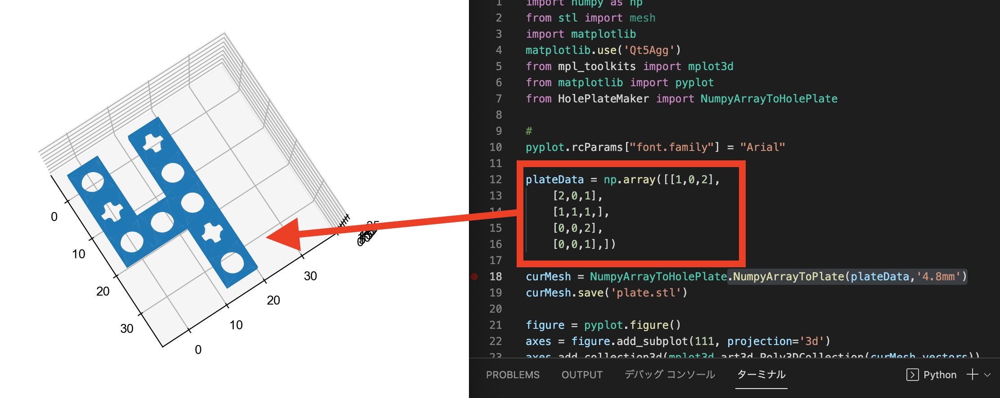

# 先にお読みください。
このライブラリは個人的に作られたプログラムです。 当ライブラリによって作成された成果物と互換する製品の製造者との関係は一切ございません。また、当ライブラリおよび当ライブラリにより作成された成果物に起因するいかなる賠償要求や損失に対し、本プログラムの作者はその責任を一切負わないものとします。

当ライブラリのライセンスは[MITライセンス](https://github.com/henjin0/HolePlateMaker/blob/main/LICENSE)に準拠します。

# HolePlateMaker
穴を等間隔に開けた工作用プレートの3Dデータ(STLファイル)を自作できるライブラリです。
現在はネジ止め等に有効な3 mm穴とデンマークの某有名ブロックと互換する4.8 mm穴が作成できます。
作成したSTLはお好みの３Dプリンタで出力してください。
(現状では[Da vinci nano w](https://www.xyzprinting.com/ja-JP/product/da-vinci-nano-w)で出力できることを確認しています。)

# How to use
pullしたパッケージ中でpython -m venv \[仮想環境名\]を実行し、仮想環境先につくってください。その後、下記コマンドでpythonパッケージをインストールしてください。
インストールできない場合にはpip3 install -U pipを実行してpipをアップデートしてください。

```shell:install
pip3 install -r requirements.txt
```

本githubを使いたいフォルダへcloneしてからご使用ください。

出力される結果は、下記の写真のようにnumpy配列の[0][0]を原点0,0に揃え、行方向、列方向に沿ってプレートの穴部分を追加していきます。また、type='4.8mm'を指定すると円形の穴と十字形(Axle)の穴をそれぞれ1,2という数値で指定することが可能です。



# サンプルコード(穴経3 mm)

```python:example1.py(穴径3 mm)
import numpy as np
from stl import mesh
from HolePlateMaker import NumpyArrayToHolePlate

plateData = np.array([[1,0,1],
    [1,0,1],
    [1,1,1,],
    [0,0,1],
    [0,0,1],])

curMesh = NumpyArrayToHolePlate.NumpyArrayToPlate(plateData,'3mm')
curMesh.save('example1.stl')
```

# サンプルコード(穴経4.8 mm)

```python:example2.py(穴径4.8 mm)
import numpy as np
from stl import mesh
from HolePlateMaker import NumpyArrayToHolePlate

plateData = np.array([[2,0,1],
    [1,0,2],
    [1,2,2,],
    [0,0,1],
    [0,0,2],])

curMesh = NumpyArrayToHolePlate.NumpyArrayToPlate(plateData,'4.8mm')
curMesh.save('example2.stl')
```

# 穴径4.8 mm指定がキツくなってしまう場合について 

/HolePlateMakerにてABU4.8mm_Loose.stlとBU4.8mm_Loose.stlというファイルがあります。既存のABU4.8mm.stlとBU4.8mm.stlを削除した上で先述の２つのファイルをABU4.8mm.stlおよびBU4.8mm.stlとリネームして再度プログラムを実行してください。

それでも嵌合が合わない場合はヤスリ等で微調整してください。

# License

Please see [LICENSE](https://github.com/henjin0/HolePlateMaker/blob/main/LICENSE).
